# Star Chart

<picture>
  <source media="(prefers-color-scheme: light)" srcset="examples/contributions-animated-once-dark.svg">
  <source media="(prefers-color-scheme: dark)" srcset="examples/contributions-animated-once-light.svg">
  
</picture>

Generate a star history chart for a GitHub README. The output is a standalone
SVG styled like a GitHub contribution graph.

Star Chart reads a repository's star history, renders it as a contribution grid
or a conventional chart, and can commit the result on a schedule. It does not
need a dashboard, third-party image host, or runtime JavaScript.

- Contribution grid with an optional growing-column animation
- Fourteen styles: classic charts, tiled grids, milestones, comparisons, neon, terminal, and sketch
- Light, dark, and automatic themes, or both fixed themes in one run
- Aggregate several repositories or compare their growth with grouped bars
- CSS-only animation that respects `prefers-reduced-motion`
- Standalone SVG output with no scripts or external resources

It tracks stars without a telescope. The setup is pretty down to earth.

> **Status:** this repository is a reference implementation. `leereilly/star-chart@v1`
> is shown throughout as the intended published usage, but **no `v1` release
> exists yet**. Until it is published, use the repository-local form (`uses: ./`)
> from within this repo, or pin a specific commit SHA once available.

---

## 30-second setup

Prefer a guided setup? The [minimal website](https://leereilly.github.io/star-chart/)
accepts a repository name or GitHub URL and generates matching workflow and
README snippets. Its previews are synthetic, not live star counts.

Add a workflow that generates the chart and commits it on a schedule:

```yaml
# .github/workflows/star-chart.yml
name: Star Chart
on:
  schedule:
    - cron: '17 4 * * *' # daily, off-peak UTC
  workflow_dispatch:

permissions:
  contents: read

concurrency:
  group: star-chart
  cancel-in-progress: true

jobs:
  star-chart:
    runs-on: ubuntu-latest
    permissions:
      contents: write # only this job needs write, to commit the SVG
    steps:
      - uses: actions/checkout@v4

      - name: Generate star chart
        uses: leereilly/star-chart@v1 # see status note above; use ./ locally
        with:
          token: ${{ github.token }}
          repository: ${{ github.repository }}
          output: assets/star-chart.svg
          animation: once

      - name: Commit chart if it changed
        run: |
          git config user.name  'github-actions[bot]'
          git config user.email '41898282+github-actions[bot]@users.noreply.github.com'
          git add assets/star-chart.svg
          if git diff --cached --quiet; then
            echo 'No chart changes to commit.'
          else
            git commit -m 'chore: update star chart'
            git push
          fi
```

Then embed it in your README:

```markdown

```

Or with light/dark sources — set `dual_theme: true` and the action writes both
files (and hands you this snippet as the `picture_snippet` output):

```markdown
<picture>
  <source media="(prefers-color-scheme: dark)" srcset="assets/star-chart-dark.svg">
  
</picture>
```

> **Why a separate commit step?** Generating the chart needs no write access.
> `actions/checkout` runs with `contents: read`. Committing the result is a
> distinct, explicitly authorized step (`contents: write`). The action itself
> never commits, pushes, force-pushes, or changes repository settings. If your
> default branch is protected, commit to a branch and open a PR, or relax the
> protection for the bot.

A complete workflow lives at
[`.github/workflows/update-star-chart.yml`](.github/workflows/update-star-chart.yml).

---

## Styles

| Light                                                      | Dark                                                           |
| ---------------------------------------------------------- | -------------------------------------------------------------- |
|          |          |
|                            |                            |
|                            |                            |
|                              |                              |
|                  |                  |
|                            |                            |
|                  |                  |
|  |  |
|        |        |
|          |          |
|                  |                  |
|    |    |
|        |        |
|                |                |

Choose a style with `style: <name>`:

| Style                              | Visual                                                                                                              |
| ---------------------------------- | ------------------------------------------------------------------------------------------------------------------- |
| `contributions`                    | Cumulative stacked squares with a numeric star-count Y axis and shaded-tip legend; not a calendar activity heatmap. |
| `line`, `area`, `bar`, `sparkline` | Original cumulative line, filled area, bars, and compact line.                                                      |
| `grid`                             | Cumulative square-tile heatmap with numeric axes; all filled tiles in a column share its value-based intensity.     |
| `step-line`                        | Staircase with horizontal holds and jumps at bucket endpoints, even for dense data.                                 |
| `milestone-scatter`                | Observation dots with labelled milestone crossings.                                                                 |
| `milestone-area`                   | Stepped cumulative area with the same milestone markers.                                                            |
| `clustered-bar`                    | Adjacent, consistently coloured repository bars per aligned time bucket, with a legend.                             |
| `neon-glow`                        | Crisp cumulative line surrounded by translucent strokes and a local blur halo.                                      |
| `neon-glow-stream`                 | Graduated translucent area beneath a luminous boundary.                                                             |
| `ascii-terminal`                   | Actual monospaced SVG text: `#` columns, `*` tips, and `                                                            | `, `-`, `+` borders. |
| `hand-drawn`                       | Deterministic double sketch strokes and diagonal hatch fill; observations remain exact anchors.                     |

All styles support `light`, `dark`, `auto`, explicit backgrounds, and the
existing animation inputs. New styles use a shared reveal: chronological
left-to-right or simultaneous bottom-to-top, with discrete steps for `cascade`.
Reduced-motion viewers always see the complete chart. Original styles retain
their existing animations. Palette levels colour the new styles; the first
four clustered series accept the corresponding level overrides, with distinct
theme-aware colours for subsequent series.

Milestones use a deterministic 1/2/5-based interval, crossing at **source
observation endpoints**, not interpolated dates or arbitrarily merged display
buckets. Multiple thresholds crossed in one observation share a marker;
overlapping labels are omitted but tooltips retain the crossings and actual
recorded total. Flat data receives a latest-observation marker. API weeks can
still be partial; these endpoints are nominal weekly boundaries, not exact
stargazer event times.

`grid` and `ascii-terminal` round occupied heights up to the requested `rows`
resolution. Grid honours `cell_size`, `cell_gap`, and `cell_radius`; terminal
uses monospaced glyph sizing instead. Impossible dimensions fail explicitly:
reduce `rows`/`columns` or increase `width`/`height`. Clustered bars need at least
2px per repository per bucket; start with `columns: 12` for comparisons.
Neon retains staircase interpolation for sparse data, and sketch perturbations
are bounded to 1.4px around segment midpoints.

Custom palettes apply in both light and dark modes:


---

## Configuration

All inputs are optional. Defaults below are the **effective** defaults the
action uses.

### Core

| Input          | Default                    | Description                                                                                                                                                                                        |
| -------------- | -------------------------- | -------------------------------------------------------------------------------------------------------------------------------------------------------------------------------------------------- |
| `token`        | `${{ github.token }}`      | Token for API requests. Empty = unauthenticated public access.                                                                                                                                     |
| `repository`   | `${{ github.repository }}` | Repository to chart (`owner/repo`).                                                                                                                                                                |
| `repositories` | _(empty)_                  | Repositories to aggregate, or compare with `clustered-bar`.                                                                                                                                        |
| `output`       | `assets/star-chart.svg`    | Workspace-relative `.svg` output path.                                                                                                                                                             |
| `style`        | `contributions`            | One of the fourteen [styles](#styles), including `grid`, `step-line`, `milestone-scatter`, `milestone-area`, `clustered-bar`, `neon-glow`, `neon-glow-stream`, `ascii-terminal`, and `hand-drawn`. |
| `theme`        | `light`                    | `light`, `dark`, `auto`. Ignored when `dual_theme` is `true`.                                                                                                                                      |
| `dual_theme`   | `false`                    | Write a fixed light **and** dark file derived from `output`.                                                                                                                                       |
| `scale`        | `absolute`                 | `absolute` (Y-axis starts at zero) or `visible` (Y-axis starts at the window baseline).                                                                                                            |

### Multiple repositories

`repositories` accepts a comma- and/or newline-separated list of `owner/repo`
values and produces a **single aggregate chart** by default. Use
`style: clustered-bar` to compare individual repositories instead:

```yaml
with:
  style: clustered-bar
  columns: 12
  repositories: |
    octocat/hello-world
    octocat/spoon-knife
    octocat/octocat.github.io
```

Semantics:

- **Blank (default):** `repository` is charted, exactly as before.
- **Non-blank:** `repositories` wins. If `repository` is also set to something
  meaningfully different (i.e. not the workflow's own `${{ github.repository }}`
  and not already in the list), the action warns that it is not charted.
- Entries are trimmed, blanks are dropped, and duplicates are removed
  **case-insensitively**, keeping the first spelling, with a warning.
- **At most 20** repositories; a longer list fails validation.
- Weekly additions are summed by **UTC calendar week**, so repositories whose
  API week boundaries differ still line up. Cumulative values are recomputed
  from the summed additions, weeks outside a repository's own range contribute
  zero, and gaps are filled with synthetic zero weeks.
- `clustered-bar` preserves each repository's additions on that same complete
  weekly timeline **before** selecting the trailing window. Missing slots add
  zero and carry the prior cumulative count; repositories not yet created do
  not trigger coverage warnings. Bars share a common axis: `absolute` starts
  at zero, while `visible` starts at the lowest individual window baseline;
  the maximum is the largest individual series, not the aggregate sum.
- The `stars` output and header total are the **sum** of the current star
  counts. The window start uses the earliest repository creation time.
- The header title becomes `owner/a + owner/b` for two repositories, or
  `owner/a + N more repositories` beyond that. Set `title` to override it.
- Every repository is fetched through the same API flow, one at a time, under
  a **single shared retry and time budget**. If any repository fails, the whole
  run fails naming that repository, **before any file is written** and before
  any output is set.


### Light and dark files (`dual_theme`)

`dual_theme: true` fetches and models the data **once** and renders it twice,
writing a fixed light and a fixed dark SVG. The paths are derived from `output`
by inserting a suffix before the extension (the extension's case is preserved):

| `output`                | Light file                    | Dark file                    |
| ----------------------- | ----------------------------- | ---------------------------- |
| `assets/star-chart.svg` | `assets/star-chart-light.svg` | `assets/star-chart-dark.svg` |

The single-theme `output` file itself is **not** written. `theme` is ignored in
dual mode (and warns if you set it), `chart_path` is the light path, and the
`picture_snippet` output gives you ready-to-paste markup. See
[Recipes](#recipes) below.

### Time window

| Input    | Default   | Description                                                             |
| -------- | --------- | ----------------------------------------------------------------------- |
| `period` | _(empty)_ | `3m`, `6m`, `1y`, `2y`, `5y`, `all`. **Takes precedence over `weeks`.** |
| `weeks`  | _(empty)_ | Explicit trailing week count. Ignored when `period` is set.             |

When both are empty the effective window is **1 year (52 weeks)**. Period
lengths: `3m`=13, `6m`=26, `1y`=52, `2y`=104, `5y`=260 API weeks; `all` uses all
available history. Setting both emits a warning and `period` wins.

### Start at zero or zoom in (`scale`)

**Star-count axes start at zero by default.** Set `scale: absolute` explicitly
to keep that zero baseline, or choose `scale: visible` to zoom in from the
cumulative count immediately before the selected time window.

These examples use the **same synthetic history and three-month window**;
only `scale` changes. In both charts, the line starts at the existing cumulative
star count when the window begins, not at zero. The enlarged axis labels make
the zero baseline easy to compare:

| Y-axis starts at zero — `scale: absolute` (default)                                                                   | Window baseline — `scale: visible`                                                                                          |
| --------------------------------------------------------------------------------------------------------------------- | --------------------------------------------------------------------------------------------------------------------------- |
|  |  |

Use either step in your workflow after checkout (see the release status note
above):

```yaml
- name: Chart with a zero-based star-count axis
  uses: leereilly/star-chart@v1 # use ./ locally until v1 is published
  with:
    token: ${{ github.token }}
    repository: ${{ github.repository }}
    output: assets/star-chart-zero.svg
    style: line
    theme: light
    period: 3m
    scale: absolute # default; the y-axis starts at 0
    axis_font_size: 20
```

```yaml
- name: Chart zoomed to the window baseline
  uses: leereilly/star-chart@v1 # use ./ locally until v1 is published
  with:
    token: ${{ github.token }}
    repository: ${{ github.repository }}
    output: assets/star-chart-visible.svg
    style: line
    theme: light
    period: 3m
    scale: visible
    axis_font_size: 20
```

`scale` changes the vertical range, **not the historical counts**. A zero-based
axis does not force the first plotted point to zero: stars recorded before
the window still count. `visible` does not subtract that history or turn the
chart into “stars gained since the window began.” All styles show a numeric
star-count axis by default except compact sparklines; use `show_y_axis` to
override this. Clustered comparisons use the lowest individual baseline.

### Layout

| Input         | Default | Description                                         |
| ------------- | ------- | --------------------------------------------------- |
| `columns`     | `52`    | Grid width in blocks (horizontal display buckets).  |
| `rows`        | `26`    | Tiled/terminal height in blocks (vertical levels).  |
| `width`       | `900`   | SVG width in px.                                    |
| `height`      | `auto`  | SVG height in px, or `auto` to follow the geometry. |
| `cell_size`   | `auto`  | Cell edge in px for `contributions` and `grid`.     |
| `cell_gap`    | `auto`  | Gap between cells in px.                            |
| `cell_radius` | `auto`  | Cell corner radius (≤ half of `cell_size`).         |

`columns` and `rows` size the grid in **blocks**. The default layout is 52
blocks wide by 26 blocks high. `width` and `height` size the rendered image in
**pixels** and are independent of the block counts.

Automatic tile sizing fits **both** the available width and any
explicit height, after reserving header, axes, legend, date, and logo space. Cells remain
square, at least 3px across. Automatic geometry follows GitHub's contribution
grid proportions: a 3px gap and 2px radius for a 10px cell, scaled with the
cell size. Explicit cell size, gap, and radius values are never silently
scaled or clamped.
Impossible combinations fail with a sizing remedy rather than clipping the
newest columns or footer. For example, a custom `rows: 100` cannot fit into a
300px-high chart: reduce rows or increase height/use `auto`. A 240px-wide
default 52-column `contributions` chart fits with 3px cells and 1px gaps.
`grid` also reserves a numeric axis gutter, so it needs a wider image at that
resolution. More columns may require a wider image. Automatic height preserves
all requested tile rows.

### Header & labels

| Input            | Default                                                  | Description                                                                                          |
| ---------------- | -------------------------------------------------------- | ---------------------------------------------------------------------------------------------------- |
| `show_title`     | `true`                                                   | Show the repository title.                                                                           |
| `show_total`     | `true`                                                   | Show the current star count.                                                                         |
| `show_change`    | `true`                                                   | Show recorded additions for the period.                                                              |
| `show_dates`     | `true`                                                   | Show sparse date labels when `show_x_axis` is enabled.                                               |
| `show_x_axis`    | `true`                                                   | Show the horizontal axis; hiding it also hides date labels.                                          |
| `show_y_axis`    | _(style default)_                                        | Show numeric ticks, spine and gridlines. Blank: on except for `sparkline`; `true`/`false` overrides. |
| `show_legend`    | _(style default)_                                        | Show the series/shading legend. Blank: on except for `sparkline`; `true`/`false` overrides.          |
| `title`          | _(empty)_                                                | Override title; blank derives `owner/repo`.                                                          |
| `date_format`    | `short`                                                  | `short` (Sep 2026), `long` (Sep 6, 2026), `iso` (2026-09-06).                                        |
| `axis_font_size` | `10`                                                     | Date, y-axis tick and legend font size in px, 6–48.                                                  |
| `logo`           | `true`                                                   | Show the small “Star Chart” wordmark.                                                                |
| `font_family`    | `-apple-system,BlinkMacSystemFont,"Segoe UI",sans-serif` | CSS font-family list.                                                                                |

The header moves statistics below the title when space is tight, and separates
total/change rows if needed. Long visual titles are ellipsized; the complete
title remains in the accessible SVG `<title>`. Explicit SVG text lengths keep
header/date labels within their reserved regions even with custom fonts.
Plot and automatic image height follow the resulting header height.

Axes and legends are independently configurable in every style:

```yaml
with:
  show_x_axis: true
  show_y_axis: true
  show_legend: true
  show_dates: false # keep the X baseline, omit its date text
```

`contributions` shows **cumulative recorded stars**, rounded to whole tile
heights. Its numeric ticks align to those tile levels; the darkest square is
the **column tip**, followed by lighter squares one, two, and three or more
rows below it. These shades are not star-count bins or weekdays.
`grid` instead uses four cumulative-value intensity ranges, each excluding its
lower bound and including its upper bound: `(low, high]`. The ranges follow
`scale`, including the nonzero baseline in visible mode. **Unoccupied** tiles
are above the column height, not missing dates or a separate series.

Other styles label their single series **Recorded stars**, or **Combined
recorded stars** when aggregating repositories. Only `clustered-bar` has
independent repository series and a name/colour key for each. Recorded
additions can differ from the current header star count because of unstars
and GitHub's available history; `period: all` uses all available history, not
guaranteed complete lifetime data.

`axis_font_size` controls sparse dates, numeric Y ticks, and legend text.
The reserved date band, y-axis gutter, and legend rows scale with it.
Legends wrap, long names are ellipsized with complete SVG titles, and labels
stay outside animation clips. Hidden axes/legends release their reserved
space. Very small explicit dimensions may require fewer rows/columns, hidden
labels, or a larger/automatic height; unreadable layouts fail clearly rather
than clipping. Raise the font size when the SVG is displayed narrower than it is
rendered — a browser fitting an 1800px-wide chart into a 1080px slot also
scales 10px labels down to about 6px. The hero above is generated at
`width: 1800` with `axis_font_size: 20` for exactly that reason.

### Colors

| Input                            | Default       | Description                           |
| -------------------------------- | ------------- | ------------------------------------- |
| `background_mode`                | _(inferred)_  | `transparent` or `solid`. See below.  |
| `background`                     | `transparent` | `transparent` or a hex colour.        |
| `empty_color`                    | _(theme)_     | Override the empty-cell colour (hex). |
| `level_1_color`..`level_4_color` | _(theme)_     | Override the four fill levels (hex).  |

`background_mode` selects how `background` is interpreted (case-insensitive):

- **Blank (default):** infer from `background` — `transparent`, `none`, or an
  empty value renders transparent; a hex value renders as a solid fill.
- **`transparent`:** always transparent. Any supplied `background` colour is
  ignored with a warning.
- **`solid`:** requires a valid hex `background`; an empty, `transparent`,
  `none`, or CSS-name value fails validation.

Quote hex values in YAML so the leading `#` is not treated as a comment:

```yaml
with:
  background_mode: solid
  background: '#0d1117'
```

Default palettes:

- **Light:** empty `#ebedf0`, `#9be9a8`, `#40c463`, `#30a14e`, `#216e39`.
- **Dark:** empty `#30363d`, `#0e4429`, `#006d32`, `#26a641`, `#39d353`.

The fill levels match GitHub's contribution graph. The dark empty cell is
lightened from GitHub's `#161b22` so unfilled squares stay visibly grey on a
dark README background; override it with `empty_color` to get GitHub's exact
value back.

### Animation

| Input                 | Default         | Description                                        |
| --------------------- | --------------- | -------------------------------------------------- |
| `animation`           | `none`          | `none`, `once`, `loop`.                            |
| `animation_duration`  | `4s`            | Build duration.                                    |
| `animation_pause`     | `2s`            | Hold between loops (loop mode).                    |
| `animation_delay`     | `0s`            | Initial delay before the build.                    |
| `animation_style`     | `grow`          | `grow`, `reveal`, `cascade`.                       |
| `animation_direction` | `chronological` | `chronological` or `simultaneous`.                 |
| `animation_easing`    | `ease-out`      | `linear`, `ease-in`, `ease-out`, `ease-in-out`.    |
| `animate_total`       | `false`         | Reveal the header total near the end of the build. |

**Classic-style animation modes** (the nine new styles use the shared reveal
described under [Styles](#styles))

- **`grow`:** the contribution grid builds bottom-up. A single translated
  colour stack per column keeps the correct moving “tip” (one level-4, then
  level-3, level-2, then level-1) grid-aligned at every step, so the animation
  stays efficient (O(columns) animated elements). Chronological line/sparkline
  paths draw left-to-right, areas wipe left-to-right, and bars grow upward.
  Simultaneous line/area/sparkline builds reveal upward together.
- **`reveal`:** contribution columns appear at the end of their build windows;
  conventional charts use a smooth left-to-right wipe. In `simultaneous`
  direction the complete graph appears at the end of the build.
- **`cascade`:** an eased, discrete bottom-up row wave crosses the grid.
  Conventional charts reveal in `columns` discrete steps, horizontally for
  `chronological` direction or upward for `simultaneous`.

`once` plays a single build and stays permanently at the final state
(`fill-mode: both`). `loop` shares a `duration + pause` timeline and repeats;
only the initial `animation_delay` sits outside the cycle.
Every renderer finishes by the build boundary and holds unchanged through the
pause. Chronological column/bar windows overlap (at least 25% for sparse
charts); the first starts at zero and the last finishes at the build boundary.
Simultaneous windows all start at zero and finish together. `animate_total`
reveals the actual current-stars text during the final 10% of the build, not
the pause; it does not run a JavaScript counter or alter recorded values.

### Outputs

| Output              | Description                                                       |
| ------------------- | ----------------------------------------------------------------- |
| `chart_path`        | Path of the generated SVG (the **light** file in dual mode).      |
| `chart_path_light`  | Light path in dual mode; empty in single mode.                    |
| `chart_path_dark`   | Dark path in dual mode; empty in single mode.                     |
| `stars`             | Current stargazer count (summed across all charted repositories). |
| `stars_added`       | Recorded additions within the selected window.                    |
| `growth_percentage` | Window additions relative to the pre-window baseline.             |
| `peak_gain`         | Largest additions in a single selected **source week**.           |
| `period_start`      | ISO UTC date of the window start.                                 |
| `period_end`        | ISO UTC date of the window end.                                   |
| `picture_snippet`   | `<picture>` markup for the pair; empty in single mode.            |

Outputs are set **only** after every file has been written successfully. A
failure anywhere — one repository of an aggregate, one file of a pair — leaves
no output set.

**`growth_percentage`** is `stars_added / baseline * 100`, fixed to two
decimals with a trailing `%` (e.g. `12.50%`), where the baseline is the
cumulative additions immediately _before_ the window. The zero-baseline policy
is explicit:

| Baseline | Additions | Value    |
| -------- | --------- | -------- |
| `> 0`    | any       | `12.50%` |
| `0`      | `0`       | `0.00%`  |
| `0`      | `> 0`     | `∞`      |

**`peak_gain`** is the biggest week the API actually recorded inside the
window. It is deliberately **not** the biggest display bucket: with
`columns` smaller than the week count, one bucket merges several weeks and
would overstate the spike.

**`picture_snippet`** is emitted only in dual mode. It uses the dark file as
the `prefers-color-scheme: dark` source and the light file as the universal
`` fallback, keeps the workspace-relative paths, and escapes every
attribute value and the alt text:

```html
<picture>
  <source
    media="(prefers-color-scheme: dark)"
    srcset="assets/star-chart-dark.svg"
  />
  
</picture>
```

---

## Recipes

Copy-paste workflows for the three most common setups.

### 1. Chart on your profile README

Your profile repository (`your-name/your-name`) can chart any repository you
like — including an aggregate of everything you maintain:

```yaml
# .github/workflows/star-chart.yml in your-name/your-name
name: Star Chart
on:
  schedule:
    - cron: '17 4 * * *'
  workflow_dispatch:

permissions:
  contents: read

concurrency:
  group: star-chart
  cancel-in-progress: true

jobs:
  star-chart:
    runs-on: ubuntu-latest
    permissions:
      contents: write
    steps:
      - uses: actions/checkout@v4

      - name: Generate star chart
        uses: leereilly/star-chart@v1 # see status note above; use ./ locally
        with:
          token: ${{ github.token }}
          repositories: |
            your-name/first-project
            your-name/second-project
          output: assets/stars.svg
          period: 1y
          animation: once

      - name: Commit chart if it changed
        run: |
          git config user.name  'github-actions[bot]'
          git config user.email '41898282+github-actions[bot]@users.noreply.github.com'
          git add assets/stars.svg
          git diff --cached --quiet || {
            git commit -m 'chore: update star chart'
            git push
          }
```

Then embed it:

```markdown

```

### 2. Protected default branch: open a pull request

When the default branch is protected, commit to a side branch and let `gh`
open or update a single rolling PR. Only first-party, SHA-pinned actions are
used:

```yaml
name: Star Chart
on:
  schedule:
    - cron: '17 4 * * *'
  workflow_dispatch:

permissions:
  contents: read

concurrency:
  group: star-chart
  cancel-in-progress: true

jobs:
  star-chart:
    runs-on: ubuntu-latest
    permissions:
      contents: write # push the chart branch
      pull-requests: write # open/update the PR
    steps:
      - uses: actions/checkout@v4 # pin to a SHA in production

      - name: Generate star chart
        uses: leereilly/star-chart@v1 # see status note above
        id: chart
        with:
          output: assets/star-chart.svg

      - name: Open or update the chart PR
        env:
          GH_TOKEN: ${{ github.token }}
          CHART: ${{ steps.chart.outputs.chart_path }}
          STARS: ${{ steps.chart.outputs.stars }}
          GROWTH: ${{ steps.chart.outputs.growth_percentage }}
          BRANCH: chore/star-chart
        run: |
          git config user.name  'github-actions[bot]'
          git config user.email '41898282+github-actions[bot]@users.noreply.github.com'
          git checkout -B "$BRANCH"
          git add -- "$CHART"
          if git diff --cached --quiet; then
            echo 'No chart changes; nothing to propose.'
            exit 0
          fi
          git commit -m 'chore: update star chart'
          git push --force-with-lease origin "$BRANCH"
          if [ -z "$(gh pr list --head "$BRANCH" --state open --json number --jq '.[].number')" ]; then
            gh pr create \
              --head "$BRANCH" \
              --title 'chore: update star chart' \
              --body "Automated star chart refresh ($STARS stars, $GROWTH growth)."
          else
            echo 'Existing PR updated by the push.'
          fi
```

`gh` is preinstalled on GitHub-hosted runners; `GH_TOKEN` is all it needs.

### 3. Light and dark images in one README

Generate both files in a single run and paste the snippet the action gives you:

```yaml
- name: Generate star charts
  uses: leereilly/star-chart@v1 # see status note above
  id: chart
  with:
    output: assets/star-chart.svg
    dual_theme: true

- name: Show the embed snippet
  env:
    SNIPPET: ${{ steps.chart.outputs.picture_snippet }}
  run: printf '%s\n' "$SNIPPET" >> "$GITHUB_STEP_SUMMARY"

- name: Commit charts if they changed
  env:
    CHART_LIGHT: ${{ steps.chart.outputs.chart_path_light }}
    CHART_DARK: ${{ steps.chart.outputs.chart_path_dark }}
  run: |
    git config user.name  'github-actions[bot]'
    git config user.email '41898282+github-actions[bot]@users.noreply.github.com'
    git add -- "$CHART_LIGHT" "$CHART_DARK"
    git diff --cached --quiet || {
      git commit -m 'chore: update star charts'
      git push
    }
```

> Outputs are passed through `env:` and quoted rather than interpolated
> directly into the shell. `title`, and therefore the alt text inside
> `picture_snippet`, is free text; `${{ }}` interpolation would splice it into
> the script itself.

```markdown
<picture>
  <source media="(prefers-color-scheme: dark)" srcset="assets/star-chart-dark.svg">
  
</picture>
```

Two fixed files always match the reader's theme, without depending on how a
client or CDN handles `prefers-color-scheme` inside an ``.

---

## Gallery

Every image below is generated by `npm run examples` from one deterministic
synthetic history, so the differences are purely configuration.

**Styles** — see the [Styles](#styles) table above for all fourteen in both themes.

| Configuration                             | Example                                                     |
| ----------------------------------------- | ----------------------------------------------------------- |
| `theme: auto` + custom palette            |       |
| `background_mode: solid`, `#0d1117`, dark |         |
| `background_mode: solid`, `#ffffff`, line |           |
| `period: 3m`                              |  |
| `period: all`, area, dark                 |               |
| `animation: once`, `reveal`, line         |      |
| `animation: loop`, `cascade`, bar, dark   |       |
| Aggregate of three repositories           |      |
| Aggregate, line style                     |         |

The `contributions-static-light`/`-dark` pair shows what `dual_theme` writes,
and `contributions-animated-once-*` / `contributions-animated-loop-*` are the
animated heroes.

---

## Themes, accessibility, and browser limitations

- **Auto theme** uses CSS variables with a `prefers-color-scheme: dark` media
  override embedded in the SVG. Modern browsers honour this inside an
  ``-embedded SVG, but **GitHub's theme, client, and CDN caching can affect
  when it updates**. For guaranteed light/dark, set `dual_theme: true` and use
  the `picture_snippet` output (see [Recipes](#recipes)).
- **Reduced motion:** animations are wrapped in
  `@media (prefers-reduced-motion: no-preference)`. When a viewer prefers reduced
  motion (or animation is `none`), the SVG shows its **final state immediately**.
  The static attributes always describe the finished chart. There is no
  JavaScript and no SMIL.
- **Accessibility:** each SVG has a `<title>`/`<desc>` summarising the repository,
  range, current stars, recorded growth, scale, and any coverage caveats. The
  decorative plot is `aria-hidden`, with one hover `<title>` per column rather
  than thousands of focusable cells.

## Data semantics

Star Chart uses GitHub's star-history API
(`GET /repos/{owner}/{repo}/stargazers/history`, API version `2026-03-10`).

- The chart plots the **cumulative sum of GitHub-recorded weekly additions**.
- The header's **current stars** and the `stars` output come from the
  repository's `stargazers_count`. Because the additions series and the current
  count are produced differently (unstarring, historical retention), **they can
  differ**. Star Chart never rewrites history to match today's count.
- With `repositories`, weekly additions are keyed by **UTC calendar week** and
  summed before cumulative values are recomputed, current star counts are
  summed, and the earliest repository creation time is used. Aggregation is a
  sum; Star Chart does not draw one series per repository.
- `all` means **all available API history**, not an independently verified
  lifetime ledger.
- API week/day boundaries are **not guaranteed to be UTC**; timestamps are
  preserved as returned, while date **labels** are formatted in UTC for
  determinism.
- Internal coverage gaps are filled with zero-addition weeks and flagged in the
  description; interrupted pagination is treated as an error, not a partial
  success.
- `columns` is independent of `period`: 13 weeks can still produce 52 temporal
  display intervals. Boundaries subdivide the original weekly intervals
  (including any timestamp offsets), using the next source timestamp as the
  week end and a nominal seven-day end for the final week. That last week may
  still be partial; its recorded total is not prorated or extrapolated.
  Empty intervals carry the previous cumulative value until an entire weekly
  observation is included. Line/area/sparkline samples use interval endpoints
  and step interpolation when carry-forward slots exist, never invented
  intra-week growth. Bars use interval centers with inset widths; tooltips
  give interval bounds and end totals. Contribution dates label interval
  starts. The `period_start`/`period_end` outputs still identify the first/last
  selected source week starts, not future observation times.

## Authentication & rate limits

- The default `${{ github.token }}` is sufficient and needs only read access.
- Unauthenticated access works for public repositories but has lower rate
  limits.
- Requests use bounded retries with per-request timeouts and an overall budget,
  honouring `Retry-After` and rate-limit reset headers. Tokens are masked in
  logs and never written into the SVG.
- Server-directed waits are **not capped at 90 seconds**: delta-seconds and
  HTTP-date `Retry-After` values and primary reset timestamps are honoured in
  full. If the remaining five-minute budget cannot accommodate the wait, the
  action fails immediately with the retry time instead of sending premature
  requests. Headerless secondary limits wait at least 60 seconds; transient
  failures use bounded exponential backoff. Rerun after the reported time
  (programmatic callers can also supply a larger retry budget).

---

## Development

```bash
npm ci
npm test            # vitest unit + bundle smoke tests
npm run typecheck   # tsc --noEmit (strict)
npm run lint        # eslint
npm run format:check
npm run build       # esbuild bundle -> dist/index.js, dist/lib.js
npm run examples    # regenerate examples/*.svg
npm run test:bundle # run the built action against a stubbed network
npm run preview     # write preview/index.html gallery (git-ignored)
```

Star Chart is bundled with [esbuild](https://esbuild.github.io/), a maintained
alternative to `@vercel/ncc`, producing a self-contained ESM bundle
that Node 24 runs directly. The `dist/` bundle and `examples/` SVGs are
committed and verified for drift in CI.

Architecture: **API client → normalized history → cumulative prefix sums →
time buckets → chart model → renderer**. Renderers are registered in a small
registry (`src/renderers/index.ts`), so adding a new style is self-contained.

The programmatic API is exported from `dist/lib.js` (side-effect free):
`parseInputs`, `parseRepositories`, `normalizeHistory`, `aggregateHistories`,
`aggregateMetadata`, `buildChartModel`, `renderChart`, `renderStarChart`,
`buildMultiRepositoryChartModel`, `renderMultiRepositoryStarChart`,
`deriveDualPaths`, `formatGrowthPercentage`, and `buildPictureSnippet`.

For example, supply independently normalized histories for comparisons:

```js
import {
  parseInputs,
  normalizeHistory,
  buildMultiRepositoryChartModel,
  renderMultiRepositoryStarChart,
} from './dist/lib.js';

const { config } = parseInputs({
  repositories: 'owner/first,owner/second',
  style: 'clustered-bar',
  columns: '12',
  theme: 'auto',
});
// firstMetadata/secondMetadata: RepositoryMetadata;
// firstRaw/secondRaw: weekly API responses fetched by your application.
const asOf = Date.now();
const sources = [
  { metadata: firstMetadata, history: normalizeHistory(firstRaw, { asOf }) },
  { metadata: secondMetadata, history: normalizeHistory(secondRaw, { asOf }) },
];
const svg = renderMultiRepositoryStarChart(config, sources, asOf);
const model = buildMultiRepositoryChartModel(config, sources, { asOf });
// model.series contains repository metadata, aligned buckets, selected weeks,
// historical baselines, maxima, and coverage flags.
```

The original `renderStarChart(config, metadata, history, asOf)` and
`buildChartModel` APIs remain unchanged. All non-comparison styles render the
aggregate even when `model.series` is present. A legacy single-repository model
can render `clustered-bar`; multiple configured repositories without independent
series fail clearly rather than inventing comparisons from an aggregated total.

### Documentation website

`docs/` is a static, GitHub Pages-compatible setup builder with official
[Primer CSS](https://primer.style/) pinned to version 21.5.1 via a CDN and
verified with subresource integrity. No server, token, or build step is needed
to serve it. Enable Pages from your default branch's `/docs` folder. Until
Pages is enabled, the website link above may not resolve.

Repository input accepts `owner/repo` or a GitHub URL, including optional
`http(s)://`, `www.`, trailing slash, and `.git`. Only GitHub repository roots
are accepted. Set the default branch field to match your repository, since
scheduled workflows only run on its default branch. Every snippet, image
URL, installation link, and copy action uses the same normalized input.
The site uses the action's `main` branch while v1 remains unpublished;
pin a reviewed commit SHA for production.

Run `npm run examples` to regenerate the six small synthetic previews in
`docs/samples/`. To preview locally, serve the repository with
`python3 -m http.server 8000 --bind 127.0.0.1` and open
`http://127.0.0.1:8000/docs/`. Clipboard access works on HTTPS or localhost;
when unavailable, the site offers manual copying. The Primer stylesheet
requires network access. Repository input is processed locally, without
fetching live history.

## License

[MIT](LICENSE) © 2026 Lee Reilly.
